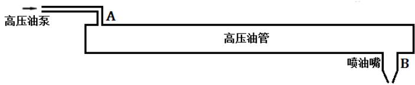
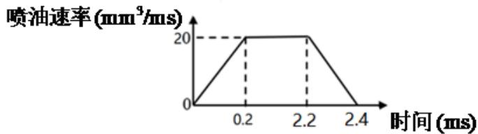
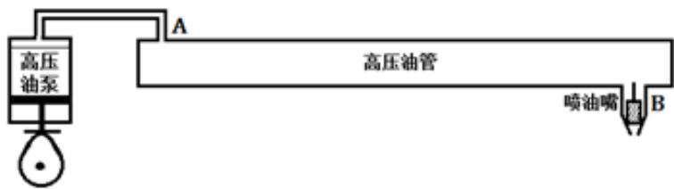
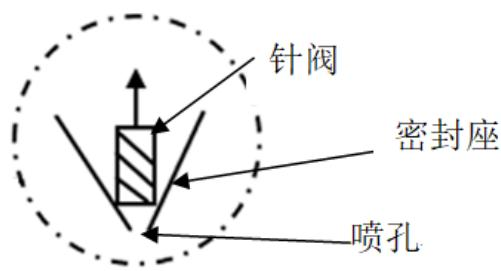
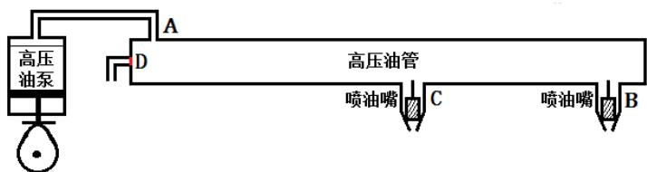

## A题 高压油管的压力控制

燃油进入和喷出高压油管是许多燃油发动机工作的基础，图 1给出了某高压燃油系统的工作原理，燃油经过高压油泵从 A 处进入高压油管，再由喷口 B 喷出。燃油进入和喷出的间歇性工作过程会导致高压油管内压力的变化，使得所喷出的燃油量出现偏差，从而影响发动机的工作效率。

  
图1 高压油管示意图

问题 1. 某型号高压油管的内腔长度为 500mm，内直径为10mm，供油入口A处小孔的直径为1.4mm，通过单向阀开关控制供油时间的长短，单向阀每打开一次后就要关闭 10ms。喷油器每秒工作 10次，每次工作时喷油时间为 2.4ms，喷油器工作时从喷油嘴 B 处向外喷油的速率如图 2 所示。高压油泵在入口 A 处提供的压力恒为160MPa，高压油管内的初始压力为 100MPa。如果要将高压油管内的压力尽可能稳定在 100 MPa 左右，如何设置单向阀每次开启的时长？如果要将高压油管内的压力从100 MPa增加到150 MPa，且分别经过约2 s、5s 和10s 的调整过程后稳定在 150 MPa，单向阀开启的时长应如何调整？

  
图2 喷油速率示意图

问题2. 在实际工作过程中，高压油管A处的燃油来自高压油泵的柱塞腔出口，喷油由喷油嘴的针阀控制。高压油泵柱塞的压油过程如图3所示，凸轮驱动柱塞上下运动，凸轮边缘曲线与角度的关系见附件1。柱塞向上运动时压缩柱塞腔内的燃油，当柱塞腔内的压力大于高压油管内的压力时，柱塞腔与高压油管连接的单向阀开启，燃油进入高压油管内。柱塞腔内直径为5mm，柱塞运动到上止点位置时，柱塞腔残余容积为20mm3。柱塞运动到下止点时，低压燃油会充满柱塞腔（包括残余容积），低压燃油的压力为0.5 MPa。喷油器喷嘴结构如图4所示，针阀直径为2.5mm、密封座是半角为9°的圆锥，最下端喷孔的直径为1.4mm。针阀升程为0时，针阀关闭；针阀升程大于0时，针阀开启，燃油向喷孔流动，通过喷孔喷出。在一个喷油周期内针阀升程与时间的关系由附件2给出。在问题1中给出的喷油器工作次数、高压油管尺寸和初始压力下，确定凸轮的角速度，使得高压油管内的压力尽量稳定在 左右。

图3 高压油管实际工作过程示意图  
  
图4 喷油器喷嘴放大后的示意图

问题3. 在问题2的基础上，再增加一个喷油嘴，每个喷嘴喷油规律相同，喷油和供油策略应如何调整？为了更有效地控制高压油管的压力，现计划在D处安装一个单向减压阀（图5）。单向减压阀出口为直径为1.4mm的圆，打开后高压油管内的燃油可以在压力下回流到外部低压油路中，从而使得高压油管内燃油的压力减小。请给出高压油泵和减压阀的控制方案。

  
图5 具有减压阀和两个喷油嘴时高压油管示意图

注1 燃油的压力变化量与密度变化量成正比，比例系数为 $J { \frac { E } { \rho } } ,$ ，其中 $^ { \lceil } \rho$ 为燃油的密度，当压力为100 MPa时，燃油的密度为 $0 . 8 5 0 \mathrm { \ m g / m m } ^ { 3 }$ 。�为弹性模量，其与压力的关系见附件3。

注2. 进出高压油管的流量为 $\begin{array} { r } { Q = C A \sqrt { \frac { 2 \Delta P } { \rho } } } \end{array}$ ，其中�为单位时间流过小孔的燃油量 $( \mathrm { m m } ^ { 3 } / \mathrm { m s } )$ ）， $C = 0 . 8 5$ 为流量系数，�为小孔的面积 $( \mathrm { m m } ^ { 2 } )$ $\Delta P$ 为小孔两边的压力差（MPa）， $\rho$ 为高压侧燃油的密度 $( \mathrm { m g } / \mathrm { m m } ^ { 3 } )$ ）。

附件1：凸轮边缘曲线

附件2：针阀运动曲线

附件3：弹性模量与压力的关系