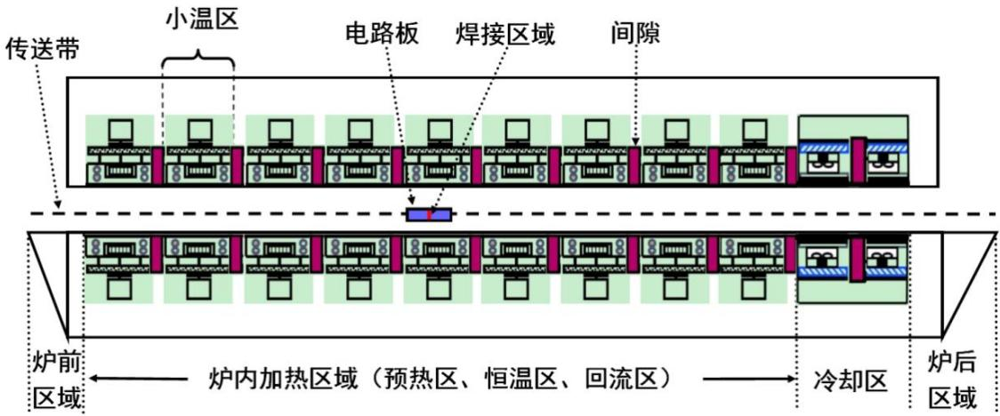
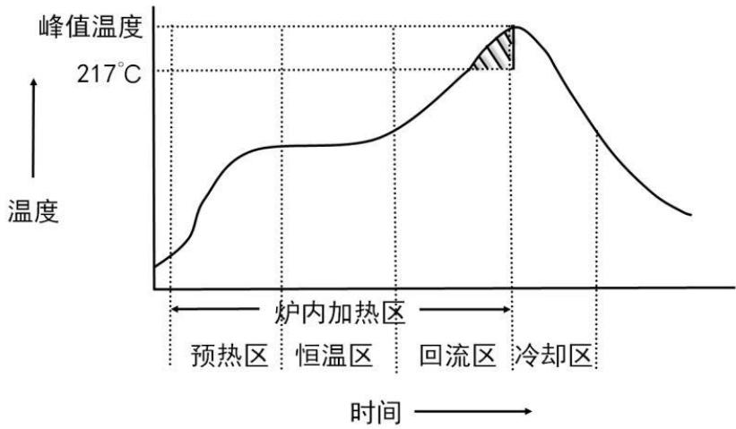

## A题 炉温曲线

在集成电路板等电子产品生产中，需要将安装有各种电子元件的印刷电路板放置在回焊炉中，通过加热，将电子元件自动焊接到电路板上。在这个生产过程中，让回焊炉的各部分保持工艺要求的温度，对产品质量至关重要。目前，这方面的许多工作是通过实验测试来进行控制和调整的。本题旨在通过机理模型来进行分析研究。

回焊炉内部设置若干个小温区，它们从功能上可分成4个大温区：预热区、恒温区、回流区、冷却区（如图1 所示）。电路板两侧搭在传送带上匀速进入炉内进行加热焊接。

  
图 1 回焊炉截面示意图

某回焊炉内有 11 个小温区及炉前区域和炉后区域（如图 1），每个小温区长度为30.5 cm，相邻小温区之间有5cm 的间隙，炉前区域和炉后区域长度均为25 cm。

回焊炉启动后，炉内空气温度会在短时间内达到稳定，此后，回焊炉方可进行焊接工作。炉前区域、炉后区域以及小温区之间的间隙不做特殊的温度控制，其温度与相邻温区的温度有关，各温区边界附近的温度也可能受到相邻温区温度的影响。另外，生产车间的温度保持在25ºC。

在设定各温区的温度和传送带的过炉速度后，可以通过温度传感器测试某些位置上焊接区域中心的温度，称之为炉温曲线（即焊接区域中心温度曲线）。附件是某次实验中炉温曲线的数据，各温区设定的温度分别为175ºC（小温区1\~5）、

$1 9 5 ^ { \circ } \mathrm { C }$ （小温区6）、 $2 3 5 ^ { \circ } \mathrm { C }$ （小温区7）、 $2 5 5 ^ { \circ } \mathrm { C }$ （小温区8\~9）及 $2 5 ^ { \circ } \mathrm { C }$ （小温区 10\~11）；传送带的过炉速度为 70 cm/min；焊接区域的厚度为 0.15 mm。温度传感器在焊接区域中心的温度达到 $3 0 ^ { \circ } \mathrm { C }$ 时开始工作，电路板进入回焊炉开始计时。

实际生产时可以通过调节各温区的设定温度和传送带的过炉速度来控制产品质量。在上述实验设定温度的基础上，各小温区设定温度可以进行± $1 0 \mathrm { { ^ \circ C } }$ 范围内的调整。调整时要求小温区1\~5 中的温度保持一致，小温区8\~9 中的温度保持一致，小温区10\~11中的温度保持 $2 5 ^ { \circ } \mathrm { C }$ 。传送带的过炉速度调节范围为65\~100cm/min。

在回焊炉电路板焊接生产中，炉温曲线应满足一定的要求，称为制程界限（见表1）。

表 1 制程界限

<table><tr><td>界限名称</td><td>最低值</td><td>最高值</td><td>单位</td></tr><tr><td>温度上升斜率</td><td>0</td><td>3</td><td>°C/s</td></tr><tr><td>温度下降斜率</td><td>-3</td><td>0</td><td>°C/s</td></tr><tr><td>温度上升过程中在150°C~190°C的时间</td><td>60</td><td>120</td><td>s</td></tr><tr><td>温度大于217°C的时间</td><td>40</td><td>90</td><td>s</td></tr><tr><td>峰值温度</td><td>240</td><td>250</td><td>°C</td></tr></table>

请你们团队回答下列问题：

问题 1 请对焊接区域的温度变化规律建立数学模型。假设传送带过炉速度为78 cm/min，各温区温度的设定值分别为 $1 7 3 \mathrm { { ‰} }$ （小温区1\~5）、198ºC（小温区6）、 $2 3 0 \mathrm { { } ^ { \circ } C }$ （小温区 7）和 257ºC（小温区 8\~9），请给出焊接区域中心的温度变化情况，列出小温区3、6、7中点及小温区8结束处焊接区域中心的温度，画出相应的炉温曲线，并将每隔0.5s焊接区域中心的温度存放在提供的result.csv中。

问题 2 假设各温区温度的设定值分别为 $1 8 2 ^ { \circ } \mathrm { C }$ （小温区 1\~5）、 $2 0 3 ^ { \circ } \mathrm { C }$ （小温区 6）、 $2 3 7 ^ { \circ } \mathrm { C }$ （小温区7）、 $2 5 4 ^ { \circ } \mathrm { C }$ （小温区8\~9），请确定允许的最大传送带过炉速度。

问题 3 在焊接过程中，焊接区域中心的温度超过 $2 1 7 \mathrm { { ^ \circ C } }$ 的时间不宜过长，峰值温度也不宜过高。理想的炉温曲线应使超过 $2 1 7 \mathrm { { ^ \circ C } }$ 到峰值温度所覆盖的面积（图 2中阴影部分）最小。请确定在此要求下的最优炉温曲线，以及各温区的设定温度和传送带的过炉速度，并给出相应的面积。

  
图2 炉温曲线示意图

问题 4 在焊接过程中，除满足制程界限外，还希望以峰值温度为中心线的两侧超过 217ºC 的炉温曲线应尽量对称（参见图 2）。请结合问题 3，进一步给出最优炉温曲线，以及各温区设定的温度及传送带过炉速度，并给出相应的指标值。